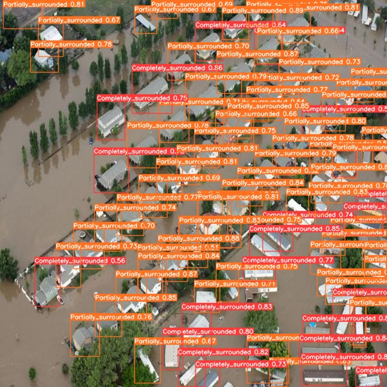
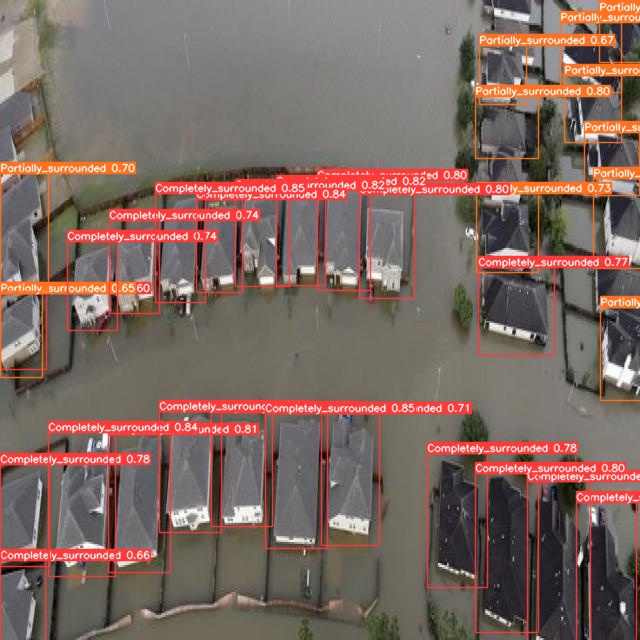
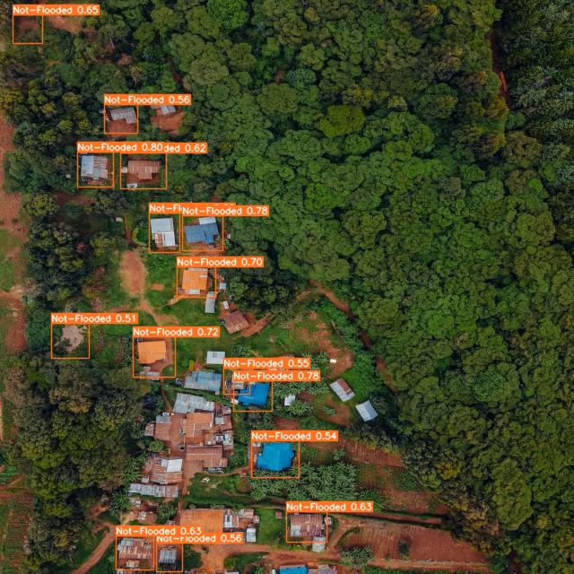

# Post-Flood House Detection Using UAV Images
Project work done for the IP1202 course of our 4th Semester

reference paper: (https://ieeexplore.ieee.org/document/10627833)

## Team members
- Aniket Choudhari (CS22B1010, GitHub: [Aniket-Choudhari-01](https://github.com/AniketChoudhari01))
- Aditya Kumar Singh (CS22B1001, GitHub: [Adityacse1001](https://github.com/Adityacse1001/Adityacse1001))
- Ankit Kujur (CS21B1005, GitHub: [AnkitKujur](https://github.com/Akitkujur025))

# Project Overview
The project aims to use YOLOv9 and UAV images to detect and classify houses after a flood. The model will sort houses into three categories: "flooded," "not-flooded," or "partially-flooded" to help with rescue and recovery efforts.

## Tools/Libraries Used
- [YOLOv9](https://github.com/ultralytics/ultralytics)
- [Roboflow](https://roboflow.com/)
- [Ultralytics](https://github.com/ultralytics/ultralytics)
- [OpenCV](https://opencv.org/)
- [TensorFlow](https://www.tensorflow.org/) or [PyTorch](https://pytorch.org/)
- [NumPy](https://numpy.org/)
- [Pandas](https://pandas.pydata.org/)
- [Matplotlib](https://matplotlib.org/) or [Seaborn](https://seaborn.pydata.org/)
- [Scikit-learn](https://scikit-learn.org/)
- [Jupyter Notebook](https://jupyter.org/) or [Google Colab](https://colab.research.google.com/)


# Implementation

## Environment Setup and YOLOv9 Installation Check

```python
!pip install -U ultralytics

from ultralytics import YOLO
import os
from IPython.display import display, Image
from IPython import display

display.clear_output()
!yolo checks
```
## Dataset 
Roboflow dataset reference: [Flood Detection Initial Training](https://app.roboflow.com/housedetectionclassification-jugwz/flood_detection_initial_training-b8i0u/1)


Export dataset:
```python
!pip install roboflow
from roboflow import Roboflow
rf = Roboflow(api_key="2boFLNkVOJpsCSgmLHGG")
project = rf.workspace("housedetectionclassification-jugwz").project("current_dataset")
version = project.version(2)
dataset = version.download("yolov9")
```

## Train model:
Note: It is trained in college AI Server
```python
!yolo\
task=detect\
mode=train\
model=runs/detect/aniket_custom_model2/weights/best.pt\
data=abc/current_dataset-2/data.yaml\
name = aniket_custom_model\
epochs= 300\
imgsz=640\
batch=8\
device=0,1,2,3\
verbose = True
```
## Results

### confusion matrix


### Precision-Recall (PR) Curve


### F1-Confidence Curve

### other metric

### Detection Results Visualization
#### sample output1:

#### sample output2:

#### sample output3:


## Future Work
- Explore and evaluate different models to find potentially better solutions for the detection and classification tasks.
- Expand the dataset with more varied images and annotations to cover different flood scenarios and reduce class imbalance.
- Refine training parameters like learning rates and batch sizes to enhance model accuracy and performance.
- Experiment with adjustments to the YOLOv9 structure or try alternative network architectures for better results.
- Use advanced techniques for data augmentation to generate more diverse training data and improve model robustness.


